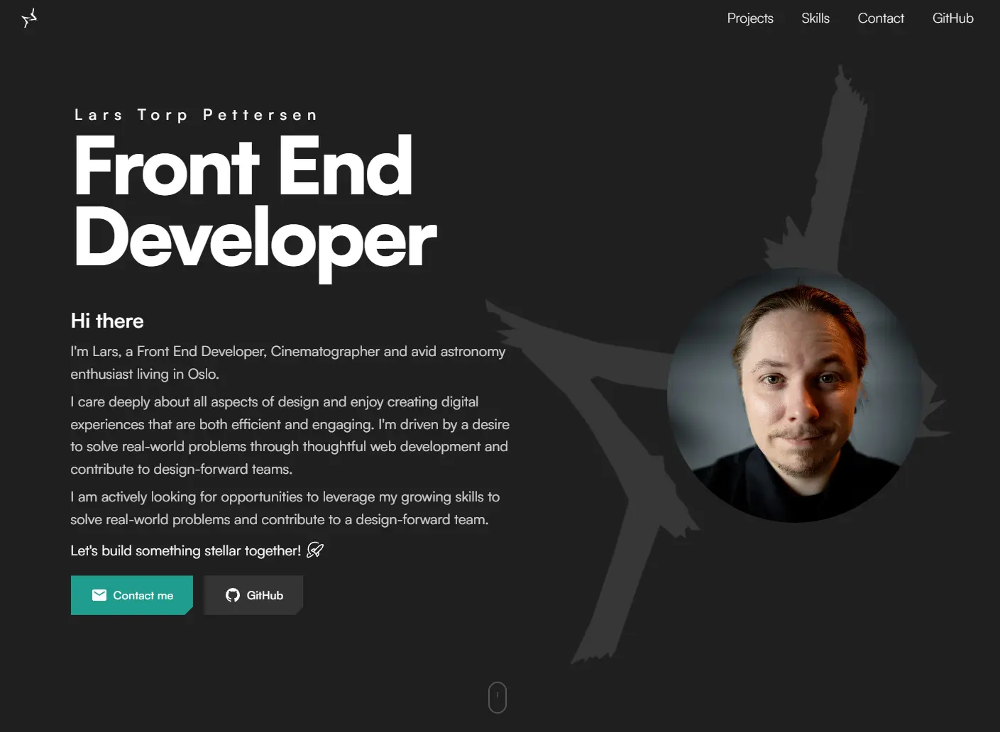

# Lars Torp Pettersen Portfolio

<p align="center">
	
</p>

Personal portfolio website for Lars Torp Pettersen, a junior front-end developer based in Oslo with a background in cinematography and a strong focus on design.

The portfolio presents selected projects from the Front-End Development course at NOROFF and is built as a React and TypeScript application with Vite.

This repository is the React-based successor to my original portfolio site, [larstp.github.io](https://github.com/larstp/larstp.github.io). It carries forward the earlier portfolio's visual direction, project-management ideas, and selected design patterns while rebuilding the experience with React, TypeScript, and Vite.

## Live Site

[larstp.com](https://larstp.com)

## Featured Projects

- [Mimir](https://mimir.larstp.com) - social platform focused on API integration and CRUD functionality
- [Butta](https://butta.larstp.com) - JavaScript framework project
- [Barter](https://barter.larstp.com) - online auction house experience

Each project has a teaser card on the home page and a dedicated Article page with additional project information.

## Technology

- React
- TypeScript
- Vite
- React Router
- Plain CSS and CSS Modules
- JSON-backed project and Article content
- Vercel Analytics
- Web3Forms for contact form submissions
- Vercel deployment

## Features

- Responsive, mobile-first layout
- Hero section with staged loading animation
- Responsive Header with mobile navigation
- Active section navigation
- Custom smooth scrolling
- Animated two-layer logo background on the Home page
- Featured project cards with technology pills
- Clickable project cards with separate Live and Repo actions
- Reusable Article page template
- JSON-driven project content
- Article image, logo, role, section, and improvement support
- Copy-link action on Article pages
- Contact form with Web3Forms integration
- Skills and Technologies section with responsive icon layout
- Favicon, manifest, robots.txt, and sitemap.xml
- Reduced-motion support
- Keyboard-accessible navigation and interactive elements

## Project Structure

```text
src/
├── components/
│   ├── ArticleSection.tsx
│   ├── Button.tsx
│   ├── ContactSection.tsx
│   ├── FeaturedProjects.tsx
│   ├── Footer.tsx
│   ├── Header.tsx
│   ├── Hero.tsx
│   ├── ProjectCard.tsx
│   ├── SectionHeader.tsx
│   ├── SkillsSection.tsx
│   └── ScrollIndicator.tsx
├── data/
│   ├── projects.json
│   ├── project-template.json
│   ├── skills.ts
│   └── technologies.json
├── hooks/
│   └── useActiveSection.ts
├── layouts/
│   └── SiteLayout.tsx
├── lib/
│   ├── constants/
│   │   └── navigation.ts
│   └── services/
│       └── web3forms.ts
├── pages/
│   ├── Article/
│   └── Home/
├── utils/
│   └── smoothScroll.ts
├── App.tsx
├── main.css
└── main.tsx
```

Component styles are kept close to their components through CSS Modules. `main.css` contains the global design tokens, font loading, reset, accessibility focus styles, and shared foundations.

## Project Data

Project and technology content is stored in JSON:

```text
src/data/projects.json
src/data/technologies.json
```

The Home page displays projects where both conditions are true:

```json
"featured": true,
"status": "active"
```

Archived projects remain in the JSON with:

```json
"featured": false,
"status": "archived"
```

The complete manual project-entry template is available at [documentation/project-template.json](documentation/project-template.json).

The manual workflow is documented in [documentation/add-project-howto.md](documentation/add-project-howto.md).

## Adding a Project Manually

1. Add project images to `public/images/projects/`.
2. Add project logos to `public/images/projects/logos/` when needed.
3. Keep thumbnails and Article images in `.webp`, `.png`, or `.jpeg` format and below 200 KB.
4. Copy the object from `documentation/project-template.json` into `src/data/projects.json`.
5. Add the correct technology IDs from `src/data/technologies.json`.
6. Set `featured` and `status` appropriately.
7. Run the validation commands below.

The future interactive `npm run add-project` workflow is intentionally deferred until after the assignment submission.

## Local Development

Install dependencies:

```bash
npm install
```

Start the development server:

```bash
npm run dev
```

The site is then available at the local Vite URL shown in the terminal.

## Environment Variables

The contact form uses Web3Forms. Create a local `.env.local` file in the project root:

```env
VITE_WEB3FORMS_ACCESS_KEY=your_web3forms_access_key
```

`.env.local` is ignored by Git. The same variable must be added to the Vercel project environment for deployed form submissions.

## Validation Commands

Typecheck the project:

```bash
npm run typecheck
```

Run ESLint:

```bash
npm run lint
```

Build for production:

```bash
npm run build
```

Preview the production build locally:

```bash
npm run preview
```

## Vercel Deployment

The project is configured for Vercel through [vercel.json](vercel.json):

- Build command: `npm run build`
- Output directory: `dist`
- SPA rewrites for React Router routes

Current public SEO files include:

- `/robots.txt`
- `/sitemap.xml`
- `/icons/favicon/site.webmanifest`

## Accessibility and Performance

The project includes:

- Semantic landmarks and headings
- Accessible labels for form fields and navigation
- Visible keyboard focus states
- External link security attributes
- Meaningful image alt text
- Reduced-motion support
- Lazy loading for project-card images
- Responsive layouts across mobile, tablet, and desktop
- Optimized image-size requirements for submission assets

## POR2 Specific Links

<details>
	<summary>View project repositories, POR2 pull requests, previous styling branches, and live sites</summary>

### Mimir

- [Repository](https://github.com/larstp/Mimir)
- [POR2 fixes pull request](https://github.com/larstp/Mimir/pull/7)
- [Old styling branch](https://github.com/larstp/Mimir/tree/old-styling)
- [Live site](https://mimir.larstp.com/)

### Butta

- [Repository](https://github.com/larstp/Butta)
- [POR2 fixes pull request](https://github.com/larstp/Butta/pull/1)
- [Old styling branch](https://github.com/larstp/Butta/tree/old-styling)
- [Live site](https://butta.larstp.com/)

### Barter

- [Repository](https://github.com/larstp/Barter)
- [POR2 fixes pull request](https://github.com/larstp/Barter/pull/59)
- [Old styling branch](https://github.com/larstp/Barter/tree/old-styling)
- [Live site](https://barter.larstp.com/)

</details>

## AI Log

I have made use of AI in debugging, copy, and transferring help with JSON elements and how to implement them in React, as that is not something we have ever touched on in class. For the full AI log, see [AI-log.md](documentation/AI-log.md).

## Deferred Work

The following work is intentionally postponed until the required assignment is complete:

- Interactive `npm run add-project` script
- JSON validation and sorting scripts
- Project ID generation
- GitHub Actions project automation
- Additional API integrations
- Light theme
- DecoderText hero enhancement
- Additional Article carousel content

## License and Credits

This project is released under the repository license.

Design inspiration, external assets, and borrowed components should be documented in the project documentation before final submission. Any reused open-source implementation must retain its required attribution and must not present another developer's projects or work as the author's own.
